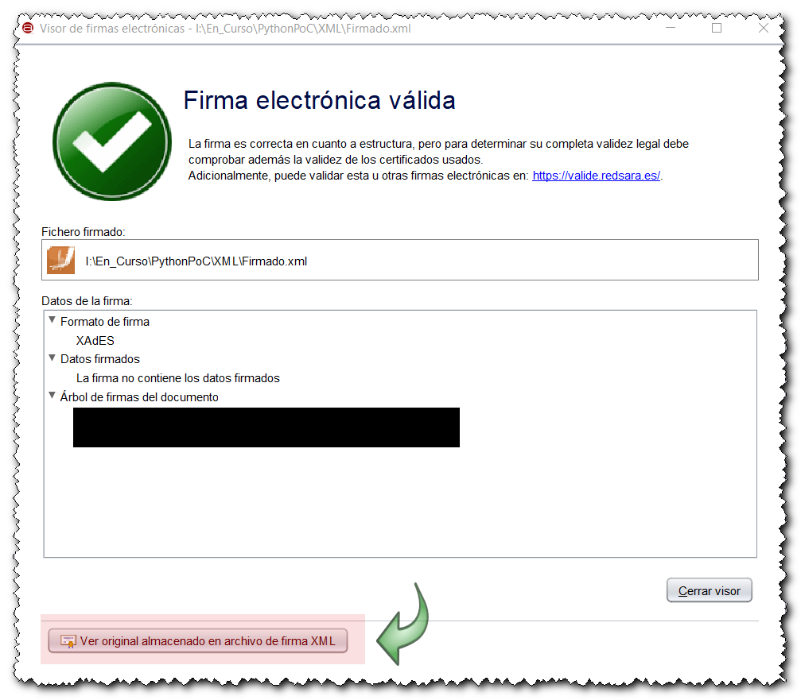
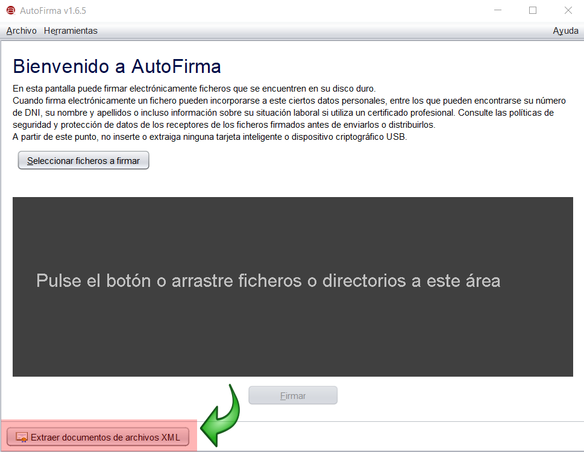
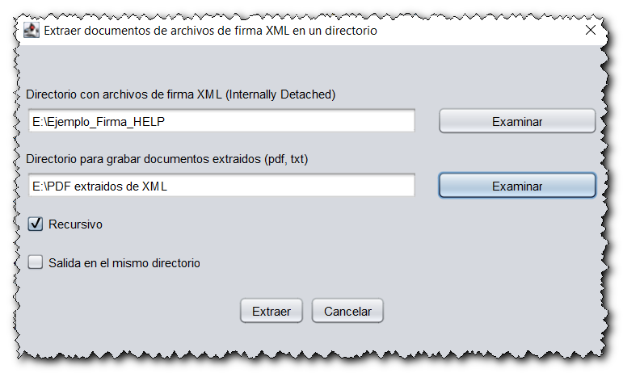
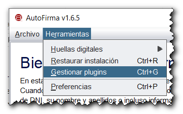
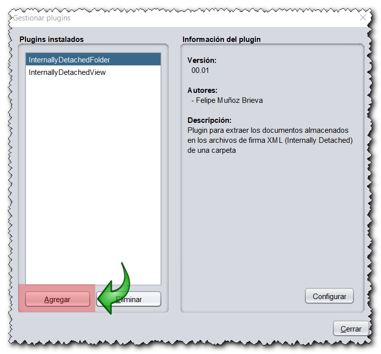

# afirma-plugins

AutoFirma es una herramienta de escritorio con interfaz gráfica que permite la ejecución de operaciones de firma de ficheros locales en entornos de escritorio (Windows, Linux y OS X ) y `mediante un sistema de plugins permite añadir nuevas funcionalidades`.

## Plugins para AutoFirma

| Plugin | Versión  | Descripción |
| --- | --- | --- |
| [**`InternallyDetachedView`**](https://github.com/digitaliza-aapp/afirma-plugins/blob/master/plugins/InternallyDetachedView/00.02/Plugin_InternallyDetachedView_v00r02.pdf?raw=yes)| [**00.02**](https://github.com/digitaliza-aapp/afirma-plugins/blob/master/plugins/InternallyDetachedView/00.02/afirma-ui-simpleafirma-plugin-internallydetachedview-v00r02.jar?raw=yes)| Visualizar documentos originales almacenados en archivos de firma XML |
| [**`InternallyDetachedFolder`**](https://github.com/digitaliza-aapp/afirma-plugins/blob/master/plugins/InternallyDetachedFolder/00.01/Plugin_InternallyDetachedFolder_v00r01.pdf?raw=yes)| [**00.01**](https://github.com/digitaliza-aapp/afirma-plugins/blob/master/plugins/InternallyDetachedFolder/00.01/afirma-ui-simpleafirma-plugin-internallydetachedfolder-v00r01.jar?raw=yes)| Extraer documentos originales almacenados en archivos de firma XML |

### 1. Plugin InternallyDetachedView

`Plugin que permite visualizar el documento almacenado internamente en un archivo de firma XML`

Existe una modalidad de firma `Internally detached` en la cual se almacena en un único fichero XML el documento original y las firmas:

```
  <documento>
     <documentoOriginal>
          …
          …
     </documentoOriginal>
     <firmas>
          …
          …
     </firmas>
  </documento>
```

y el `Visor de Firmas` de `AutoFirma` no dispone de herramientas para visualizar el documento original.

Mediante el plugin `InternallyDetachedView` se añade una nueva funcionalidad en la pantalla del `Visor de Firmas` para visualizar el documento original firmado almacenado en el archivo de firma XML. 

<p align="center">
    
</p>

### 2. Plugin InternallyDetachedFolder

`Plugin que permite extraer documentos almacenados internamente en archivos de firma XML`

Mediante el plugin `InternallyDetachedFolder` se añade una nueva funcionalidad en la pantalla inicial de `Autofirma` para extraer documentos almacenados en archivos de firma XML. 

<p align="center">
    
</p>

Para extraer los documentos almacenados en archivos de firma debe seleccionarse

- Directorio con los archivos de firma XML
- Directorio para grabar los documentos extraidos (formato pdf, txt)
- Recursivo (Buscar archivos de firma en subdirectorios)
- Almacenar los documentos extraidos en el mismo directorio que se encuentran los archivos de firma


<p align="center">
    
</p>

## Instalación de plugins

`Los plugins están empaquetados en un único JAR`

Para añadir un plugin en AutoFirma debe acceder al módulo `Herramientas&Gestionar plugins`

<p align="center">
    
</p>

y con desde el botón `Agregar` debe seleccionar el archivo JAR 

<p align="center">
    
</p>


## Contacto

Para hacer sugerencias ó reportar incidencias puede enviar un correo electrónico a digitaliza.aapp@gmail.com 

## Créditos

- [**Cliente @Firma - Portal Administración Electrónica**](https://administracionelectronica.gob.es/ctt/clienteafirma)
- [**Cliente @Firma - GitHub**](https://github.com/ctt-gob-es/clienteafirma)	
- [**AutoFirma**](https://firmaelectronica.gob.es/Home/Descargas.html)	

## Ausencia de garantías
`AUTOFIRMA PLUGINS` SE PROVEEN EN SU ESTADO ACTUAL Y SIN GARANTÍAS DE NINGÚN TIPO. NO SE OFRECE DE MANERA EXPLÍCITA, IMPLÍCITA, NI JURADA GARANTÍAS, AFIRMACIONES NI DECLARACIONES DE NINGÚN TIPO CON RESPECTO A `AUTOFIRMA PLUGINS`

## Descargo de responsabilidad
Usted recibe `AUTOFIRMA PLUGINS` de forma gratuita. POR CONSIGUIENTE, USTED RECONOCE Y ACEPTA QUE EL PERSONAL QUE HA PARTICIPADO EN EL PROYECTO NO TENDRÁ RESPONSABILIDAD ALGUNA QUE SURJA DEL USO DE `AUTOFIRMA PLUGINS` O SE RELACIONE CON DICHO USO. SU ÚNICO DERECHO O RECURSO LEGAL ANTE CUALQUIER PROBLEMA O DISCONFORMIDAD CON `AUTOFIRMA PLUGINS` ES DEJAR DE USARLOS DE INMEDIATO. 

## Disclaiming warranty
`AUTOFIRMA PLUGINS` ARE PROVIDED IN ITS CURRENT STATUS AND WITHOUT WARRANTIES OF ANY KIND. NO WARRANTIES, CLAIMS, OR STATEMENTS OF ANY KIND WITH REGARD TO
`AUTOFIRMA PLUGINS` ARE PROVIDED EXPLICIT, IMPLIED, OR SWORN.

## Limiting liability
You receive `AUTOFIRMA PLUGINS` for free. ACCORDINGLY, YOU ACKNOWLEDGE AND AGREE THAT THE PERSONNEL WHO HAVE PARTICIPATED IN THE PROJECT SHALL HAVE NO LIABILITY ARISING FROM THE USE OF `AUTOFIRMA PLUGINS` OR RELATING TO SUCH USE. YOUR SOLE RIGHT OR LEGAL REMEDY FOR ANY PROBLEM OR DISPUTE WITH AUTOFIRMA PLUGINS IS TO  STOP USING IT IMMEDIATELY.

